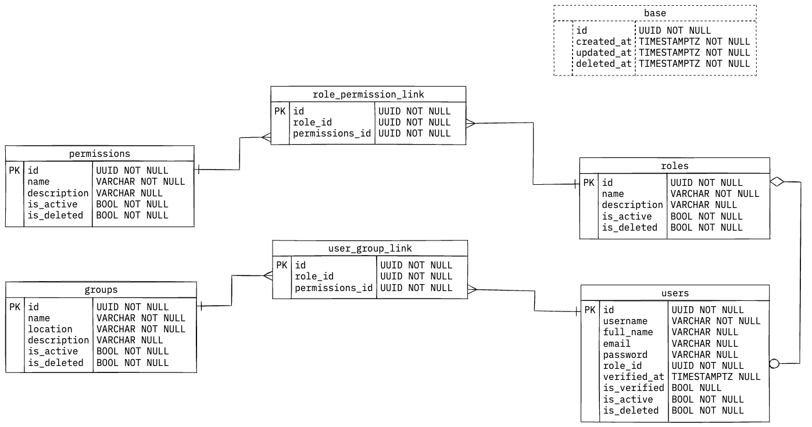

# A User management API with FastAPI

## Highlights

- Role-based authorisation
- JWT for authentication
- Users can be part of multiple groups

## Data models
The database schemas are described in the `ums.domain.entities` module.
Check out the EDR diagram, where the base table in dotted lines has the
audit attributes that all the other tables share.




The technologies used are in the [Tech section](./docs/tech.md)

## Development
The database and app (with hot reload) can be started with:

```./scripts/dev.sh up```

This will spin up a Postgres 17 container with a `docker_ums_data` volume attached
to it for the DB data, using `docker compose`. The database can be initialised with:

```poetry run python3 db/init_db.py```
